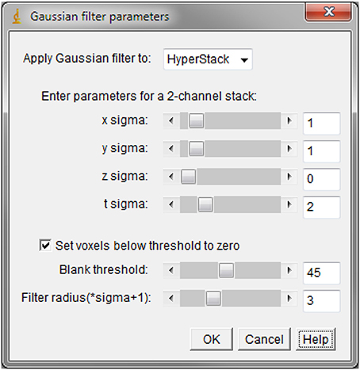

# ImageJ Plugin: Gaussian Filter 5D

This tool was created by Iaroslav Savtchouk from [Andrea volterra Laboratory](https://wwwfbm.unil.ch/dnf/group/glia-an-active-synaptic-partner/member/volterra-andrea-volterra) and published in [Studying Axon-Astrocyte Functional Interactions by 3D Two-Photon Ca2+ Imaging: A Practical Guide to Experiments and “Big Data” Analysis](https://www.frontiersin.org/articles/10.3389/fncel.2018.00098/full)

A simple 5D Gaussian filter plugin for signal processing. This was currently missing from the default ImageJ tools, since the built-in 3D filter functionality does not fully support filtering higher-order stacks (such as combined z+t). The current plugin is natively capable of processing a 5-D stack, and is able to filter in all dimensions (except across channels). A DC offset option is provided to blank arbitrary noise values below a selectable threshold.

